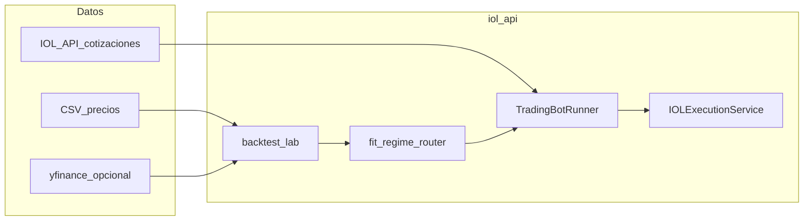

# Plan de robustez — Bot IOL / MQ26 (anclado al código)

Documento de ingeniería para alinear el **plan cuant** (métricas, backtesting, régimen, riesgo) con lo ya implementado en `services/iol_api` y scripts. **No es asesoramiento financiero** ni garantía de resultados.

**Principio rector:** el salto a producción seria depende más de **gestión de datos**, **procesos** y **validaciones** (ejecución, costos, latencias, idempotencia) que del lenguaje. Muchos sistemas fallan por detalles operativos, no por la lógica de señal en sí.

## 1. Mapa del código actual

| Capa | Archivo | Rol |
|------|---------|-----|
| Config / entorno | [`services/iol_api/config.py`](../../services/iol_api/config.py) | `IOL_TRADING_MODE`, `IOL_DRY_RUN`, límites de riesgo, URLs y paths de API. |
| Cliente HTTP + auth | [`services/iol_api/client.py`](../../services/iol_api/client.py) | Login, refresh, reintentos, `get_quote` / `get_json` / `post_json`. |
| Ejecución + riesgo | [`services/iol_api/execution.py`](../../services/iol_api/execution.py) | `place_order`, idempotencia, kill switch por archivo, dry-run. |
| Señal MA (MVP) | [`services/iol_api/strategy.py`](../../services/iol_api/strategy.py) | `MovingAverageSignalStrategy` + `SignalDecision`. |
| Señales en vivo (router) | [`services/iol_api/live_signals.py`](../../services/iol_api/live_signals.py) | Motores alineados a nombres de `build_named_strategies`. |
| Backtest / régimen | [`services/iol_api/backtest_lab.py`](../../services/iol_api/backtest_lab.py) | Estrategias nombradas, `simulate_positions`, `compare_strategies`, `fit_regime_router_walk_forward`, `current_vol_regime`, métricas de capital (`report_capital_window`, `pick_best_strategy_name`). |
| Runner | [`services/iol_api/runner.py`](../../services/iol_api/runner.py) | `TradingBotRunner`: modo legacy MA o `RegimeRouterConfig` + bloqueo de órdenes reales con router hasta validar. |
| Sandbox / catálogo | [`services/iol_api/sandbox_probe.py`](../../services/iol_api/sandbox_probe.py) | Prueba de cotización y orden opcional. |
| Export público | [`services/iol_api/__init__.py`](../../services/iol_api/__init__.py) | API pública del paquete. |
| Guía operativa | [`docs/IOL_BOT_MVP.md`](../IOL_BOT_MVP.md) | Variables `.env`, comandos de scripts. |
| Import estático cartera | [`broker_importer.py`](../../broker_importer.py) | IOL vía Excel/CSV (no reemplaza la API en vivo). |

### Scripts ejecutables (desde la raíz `MQ26_V11/`)

| Script | Comando típico |
|--------|----------------|
| [`scripts/iol_sandbox_probe.py`](../../scripts/iol_sandbox_probe.py) | `python scripts/iol_sandbox_probe.py --market argentina --symbol GGAL` |
| [`scripts/iol_strategy_backtest.py`](../../scripts/iol_strategy_backtest.py) | `python scripts/iol_strategy_backtest.py --csv ruta/precios.csv` |
| [`scripts/iol_backtest_capital_windows.py`](../../scripts/iol_backtest_capital_windows.py) | `python scripts/iol_backtest_capital_windows.py --ticker GGAL.BA --period 1y --capital 100000 --windows 30,60,90` |
| [`scripts/iol_bot_runner.py`](../../scripts/iol_bot_runner.py) | `python scripts/iol_bot_runner.py --prices-csv ...` o con `--router-json router_config.json` |

### Tests de referencia

- `tests/test_iol_api_client.py`, `tests/test_iol_execution.py`, `tests/test_iol_strategy_runner.py`, `tests/test_iol_sandbox_probe.py`
- `tests/test_iol_backtest_lab.py`, `tests/test_iol_backtest_capital_metrics.py`, `tests/test_iol_runner_router.py`

---

## 2. Métricas del plan cuant vs implementación hoy

| Métrica (plan) | Estado en repo | Próximo paso sugerido |
|----------------|----------------|------------------------|
| Win rate / tasa de aciertos | Parcial: `long_flat_roundtrip_stats` + días expuestos en [`backtest_lab.py`](../../services/iol_api/backtest_lab.py) | Unificar reporte en un solo `metrics.json` por corrida. |
| Profit factor (neto) | No calculado explícitamente | Sumar `sum(ganancias)/abs(sum(perdidas))` sobre retornos/trades netos en `backtest_lab` o script. |
| Sharpe / Sortino / Max DD | Sí en `simulate_positions` | Exponer en script de capital windows si falta columna. |
| Retorno neto post-costos | Modelo simple: `commission_pct` por cambio de posición | Añadir stress multiplicador comisión/slippage en `iol_strategy_backtest` / capital windows. |
| Walk-forward multi-ventana | Solo `train_ratio` fijo en `fit_regime_router_walk_forward` | Bucle de ventanas OOS y tabla agregada. |
| Datos alineados al broker | Parcial (API IOL); histórico backtest suele ser CSV/Yahoo | Ingesta cotizaciones IOL sandbox para el mismo `symbol` usado en real. |

---

## 3. Arquitectura objetivo (alineada al repo)

---

## 4. Checklists ejecutables

### Fase A — Entorno y credenciales (una vez)

- [ ] Cuenta IOL con **APIs activadas** (mensajes + aceptación de términos según documentación IOL).
- [ ] Variables en `.env` según [`docs/IOL_BOT_MVP.md`](../IOL_BOT_MVP.md): `IOL_USERNAME`, `IOL_PASSWORD`, `IOL_TRADING_MODE=demo`, `IOL_DRY_RUN=true`.
- [ ] `python scripts/iol_sandbox_probe.py --market argentina --symbol GGAL` → login + cotización OK (ajustar `IOL_AUTH_PATH` / endpoints si el broker exige otra ruta).

### Fase B — Backtest y selección de estrategia

- [ ] Serie de precios diaria (`close`) representativa del instrumento real.
- [ ] `python scripts/iol_strategy_backtest.py --csv ...` → revisar `comparacion_estrategias` y `router_regimen_vol` + `default_strategy` en salida JSON.
- [ ] Guardar JSON mínimo para router: `router_regimen_vol`, `default_strategy`, opcional `vol_window` / `rank_window`.

### Fase C — Stress de costos y ventanas

- [ ] `python scripts/iol_backtest_capital_windows.py --ticker GGAL.BA --capital 100000 --windows 30,60,90 --commission 0.001`
- [ ] Repetir con `--commission 0.002` (stress +100%) y comparar degradación de Sharpe / capital final.

### Fase D — Paper / runner sin real

- [ ] `python scripts/iol_bot_runner.py --prices-csv ... --router-json router_config.json`  
  Con `--router-json`, el script fuerza `IOL_DRY_RUN=true` en el proceso (ver [`iol_bot_runner.py`](../../scripts/iol_bot_runner.py)).
- [ ] Verificar en salida JSON: `router_safety`, `strategy_selected`, `vol_regime`, y que `execution.status` sea `dry_run` o no exista orden real.

### Fase E — Criterios de “ir a real” (definición operativa)

Acordar umbrales **antes** de operar (ejemplo, ajustar a tu tolerancia):

- [ ] OOS: Sharpe neto ≥ X **y** max DD ≤ Y en walk-forward agregado (definir X/Y por perfil).
- [ ] Stress costos: degradación acotada (ej. Sharpe no cae más del Z%).
- [ ] Semanas en sandbox sin incidentes de órdenes duplicadas / auth / límites.
- [ ] Solo entonces: **quitar o parametrizar** el bloqueo `router_safety_blocked` en [`runner.py`](../../services/iol_api/runner.py) `_run_once_router` si se desea enviar órdenes reales con router (hoy está a propósito como seguro).

### Fase F — Producción mínima viable

- [ ] Capital inicial acorde a límites `IOL_MAX_NOTIONAL_ARS`, `IOL_MAX_DAILY_LOSS_ARS`, `IOL_MAX_ORDERS_PER_DAY`.
- [ ] `IOL_KILL_SWITCH_FILE` definido y procedimiento para crear/borrar el archivo.
- [ ] Logging centralizado (`core/logging_config.py`) y retención de logs.
- [ ] Runbook: arranque, parada, rollback (volver a `IOL_DRY_RUN=true`).

---

## 5. Plan 30 / 60 / 90 días (incremental)

| Días | Objetivo | Entregable en repo |
|------|-----------|---------------------|
| 0–30 | Congelar datos, endpoints IOL sandbox, baseline de estrategias nombradas | JSON de `iol_strategy_backtest` + notas en este doc (changelog manual) |
| 30–60 | Router por régimen en runner + stress comisión; comparar live dry-run vs backtest | Ajustes en `backtest_lab` / scripts si hace falta; registro de discrepancias |
| 60–90 | Capital mínimo real (solo si checklist E cumplido); monitoreo semanal | Decisión documentada; sin cambios de código hasta revisión |

---

## 6. Brechas conocidas (honestidad técnica)

- Los endpoints por defecto en `config.py` pueden requerir **ajuste** a la documentación vigente de IOL (`IOL_QUOTE_ENDPOINT_TEMPLATE`, `IOL_ORDERS_ENDPOINT`, etc.).
- El backtest con **yfinance** no replica **spread, cola de órdenes ni suspensiones** BYMA.
- El router por volatilidad es una **heurística**; no sustituye modelado de régimen multi-factor ni validación legal.

---

## 7. Referencias internas adicionales

- ADR broker/datos: [`docs/adr/002-proveedores-datos-byma.md`](../adr/002-proveedores-datos-byma.md) (visión de integración broker a futuro).
- Auditoría de órdenes calculadas en app: [`services/audit_trail.py`](../../services/audit_trail.py) (órdenes “calculadas” en MQ26; el bot IOL puede extender trazabilidad similar si se desea).

---

## 8. Próxima evolución (observabilidad, runbook, versionado)

Llevar el plan **un paso más allá** sin perder el foco en datos y procesos. Esto es **backlog** sugerido; no está implementado salvo donde se indique.

### 8.1 Métricas en dashboards (ej. Prometheus + Grafana)

**Objetivo:** ver en tiempo (o near-time) lo que el backtest resume a posteriori: salud del bot, riesgo y fricción operativa.

| Familia de métrica | Ejemplos (nombres orientativos) | Notas |
|--------------------|----------------------------------|--------|
| **Riesgo / PnL** | `equity_gauge`, `drawdown_ratio`, `profit_factor_rolling` (ventana N) | PF y DD en vivo requieren definición de “trade cerrado” y reconciliación con broker. |
| **Ejecución** | `order_latency_ms`, `order_reject_total`, `auth_refresh_total`, `duplicate_order_blocked` | Histogramas para latencia; contadores para fallos. |
| **Datos** | `quote_staleness_seconds`, `last_successful_tick_timestamp` | Detectar mercado colgado o feed desalineado. |

**Implementación típica:** exponer un endpoint HTTP `/metrics` (formato Prometheus) desde un proceso ligero que lea estado del runner o escriba en un archivo rotado; Grafana como visión. En MQ26 ya existen piezas de alerta vía Telegram en [`config.py`](../../config.py) (`TELEGRAM_*`); Prometheus sería **complementario** para series y SLAs.

**Checklist (cuando se aborde):**

- [ ] Definir qué es “una observación” (cada `run_once`, cada orden, cada minuto).
- [ ] Etiquetar series con `strategy_version`, `environment` (demo/real), `symbol`.
- [ ] Paneles mínimos: equity, DD, órdenes/h, errores API, latencia p95.

### 8.2 Runbook automatizado y alertas externas

**Objetivo:** que arrancar / parar / aislar el bot no dependa de memoria humana.

| Entregable | Descripción |
|------------|-------------|
| **Scripts** | `start_bot.sh` / `stop_bot.sh` (o `.ps1` en Windows) que exporten env, validen `.env`, y lancen `iol_bot_runner.py` con flags fijos. |
| **Orquestación** | `systemd` unit, NSSM, o contenedor con restart policy y límites de recursos. |
| **Alertas** | Email / Slack / Telegram ante: fallo de auth, DD intradiario superado, kill switch activado, proceso caído (healthcheck). |

**Referencias en repo:** [`docs/RUNBOOK_INCIDENTES_DEGRADACIONES.md`](../RUNBOOK_INCIDENTES_DEGRADACIONES.md) (cultura de incidentes); Telegram ya cableado a nivel app en `config.py` (reutilizar patrón o webhook Slack vía mismo canal).

**Checklist:**

- [ ] Documentar en runbook: “cómo activar kill switch” + “cómo volver a dry-run”.
- [ ] Alerta si el proceso no escribe heartbeat en X minutos.
- [ ] Runbook de rollback: versión anterior del `router_config.json` + commit Git.

### 8.3 Versionar estrategias y parámetros (como software)

**Objetivo:** que cada cambio de reglas sea **rastreable** y **reversible** como un deploy.

| Práctica | Detalle |
|----------|---------|
| **Git** | Commits que incluyan solo cambios de `router_config.json`, umbrales en `config` documentados, y resultados OOS exportados (CSV/JSON) en carpeta `artifacts/` ignorada en `.gitignore` si son pesados — pero **sí** versionar hashes o resúmenes. |
| **Semver de “strategy pack”** | Ej. `strategies-1.2.0`: conjunto de nombres en `build_named_strategies` + parámetros documentados en un `strategies.yaml` versionado. |
| **Rollback** | Tag Git + archivo de router anterior; runner apunta a `--router-json` explícito por versión. |

**Checklist:**

- [ ] Convención de nombre: `router_config_<mercado>_<semver>.json`.
- [ ] CHANGELOG corto por versión (qué métricas OOS mejoraron/empeoraron).
- [ ] CI opcional: `pytest` sobre `tests/test_iol_*` antes de “promover” una versión de estrategia.

---

## Plan V2 — 50 mejoras (backlog extendido)

Las mejoras avanzadas (métricas tipo Ulcer/HMM, stress de datos, observabilidad completa, etc.) están **priorizadas y ancladas al código** en el documento hermano:

[**PLAN_BOT_IOL_ROBUSTEZ_V2.md**](PLAN_BOT_IOL_ROBUSTEZ_V2.md)

*Última actualización: alineado a la estructura `services/iol_api` y scripts `iol_*.py`; sección 8 añadida para observabilidad, runbook y versionado; enlace V2 añadido.*
