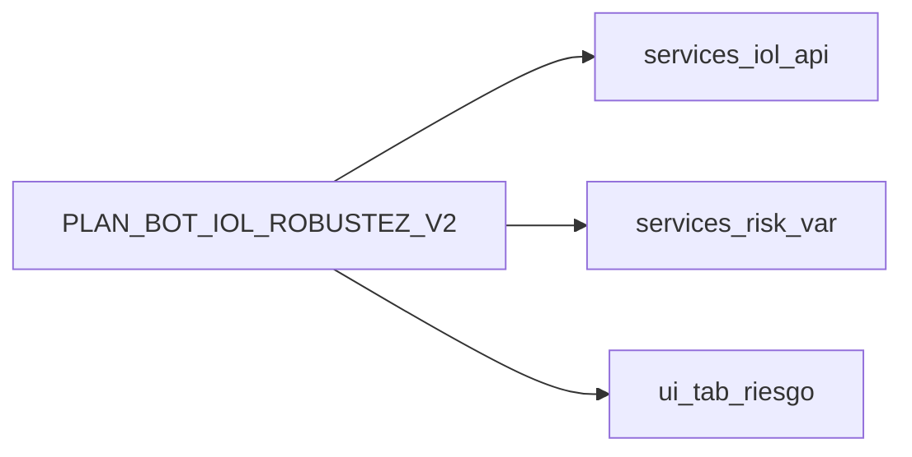

# Plan de robustez bot IOL — V2 (50 mejoras)

Extensión de [`PLAN_BOT_IOL_ROBUSTEZ.md`](PLAN_BOT_IOL_ROBUSTEZ.md): backlog **priorizado** y **anclado al repo**. No sustituye el V1; profundiza métricas, validación, arquitectura, régimen y operación.

**Principio rector (heredado del V1):** la producción seria prioriza datos, procesos y validaciones sobre el lenguaje de implementación.

**Disclaimer:** documento de ingeniería y gobernanza. No constituye asesoramiento de inversiones ni garantiza resultados.

---

## Leyenda

| Campo | Significado |
|-------|-------------|
| **P** | Prioridad sugerida: **P0** operación mínima segura, **P1** robustez estadística/técnica, **P2** nivel institucional / costo alto. |
| **Tipo** | **Doc** proceso y documentación; **Cod** cambio en `services/iol_api` o scripts bot; **MQ26** reutilizar o extender módulos existentes de la terminal; **Mix** ambos. |

---

## Tabla maestra (50 mejoras)

| # | Área | Mejora | P | Tipo | Anclaje principal | Dependencia / nota |
|---|------|--------|---|------|-------------------|---------------------|
| 1 | Métricas | Calmar ratio (retorno / max DD) | P1 | Mix | [`services/iol_api/backtest_lab.py`](../../services/iol_api/backtest_lab.py), [`services/backtester.py`](../../services/backtester.py) | Calmar ya en backtest cartera MQ26; portar a informe unificado bot. |
| 2 | Métricas | Ulcer Index (persistencia del drawdown) | P2 | Cod | `backtest_lab.py` | Requiere serie de equity y suma de drawdowns parciales. |
| 3 | Métricas | Sharpe/Sortino rolling para deterioro | P1 | Cod | `backtest_lab.py`, scripts informe | Ventana móvil configurable. |
| 4 | Métricas | Test estabilidad de parámetros (sensibilidad) | P1 | Doc+Cod | `scripts/iol_strategy_backtest.py` | Grid ligero de parámetros + tabla degradación OOS. |
| 5 | Métricas | Bootstrap de trades para IC | P1 | Cod | `backtest_lab.py` | Requiere lista de PnL por trade cerrado. |
| 6 | Métricas | Skewness y kurtosis de retornos netos | P1 | Cod | `backtest_lab.py` | Post-proceso sobre `strategy_returns`. |
| 7 | Métricas | CVaR / ES en cola de retornos | P1 | Mix | [`services/risk_var.py`](../../services/risk_var.py), `backtest_lab.py` | Motor VaR/CVaR ya en MQ26; adaptar a retornos del simulador bot. |
| 8 | Métricas | Autocorrelación de PnL (clustering pérdidas) | P2 | Cod | `backtest_lab.py` | ACF sobre retornos o PnL diario neto. |
| 9 | Métricas | Ratio de recuperación (tiempo a nuevo máximo) | P2 | Cod | `backtest_lab.py` | Definir “recovery” sobre equity curve. |
| 10 | Métricas | Documentar costos reales vs modelados por fase | P0 | Doc | [`docs/IOL_BOT_MVP.md`](../IOL_BOT_MVP.md), `PLAN_BOT_IOL_ROBUSTEZ.md` | Matriz fase → supuesto comisión/slippage → fuente real (extracto broker). |
| 11 | Backtest | Validar con múltiples proveedores de datos | P1 | Mix | `iol_backtest_capital_windows.py`, BYMA/Open Data si aplica | Comparar series alineadas por fecha; ver ADR datos. |
| 12 | Backtest | Randomización orden de trades (stress) | P2 | Cod | Nuevo módulo stress o `backtest_lab.py` | Solo si hay secuencia de trades explícita. |
| 13 | Backtest | Simular fallos de conexión en backtest | P2 | Cod | `iol_api/client.py` (patrones retry) | Inyectar drop aleatorio de ticks/órdenes en simulador. |
| 14 | Backtest | Resampling / shuffle controlado de retornos | P2 | Cod | `backtest_lab.py` | Block bootstrap por bloques temporales. |
| 15 | Backtest | Monte Carlo sobre secuencia de trades | P1 | Mix | [`ui/tab_inversor.py`](../../ui/tab_inversor.py) (referencia MC), `backtest_lab.py` | Reutilizar filosofía MC; no copiar UI en bot. |
| 16 | Backtest | Simular circuit breakers de mercado | P2 | Doc+Cod | `backtest_lab.py` | Reglas de congelamiento de precio/volumen días X. |
| 17 | Backtest | Validación cruzada temporal múltiple | P1 | Cod | `fit_regime_router_walk_forward` en [`backtest_lab.py`](../../services/iol_api/backtest_lab.py) | Varias particiones train/test, no un solo `train_ratio`. |
| 18 | Backtest | Documentar diferencias sandbox vs real + métricas | P0 | Doc | `iol_sandbox_probe.py`, docs IOL externos | Tabla de gaps conocidos (latencia, cola, partial fills). |
| 19 | Backtest | Escenarios extremos históricos (2008, COVID) | P1 | Doc+Cod | Datasets históricos descargados | Ventanas fijas de crisis en script comparativo. |
| 20 | Backtest | Automatizar comparación OOS vs in-sample con alertas | P1 | Mix | `iol_strategy_backtest.py`, alertas `config.py` | Umbral degradación → Telegram si configurado. |
| 21 | Arquitectura | Monitor de latencia en ingestión | P1 | Cod | `iol_api/client.py`, métricas | Timestamps request/response; histograma futuro Prometheus. |
| 22 | Arquitectura | Alertas de duplicación de órdenes | P0 | Cod | [`execution.py`](../../services/iol_api/execution.py) (`_is_duplicate`) | Ya hay idempotencia; añadir log explícito + contador alertable. |
| 23 | Arquitectura | Hash de datos para corrupción de feed | P1 | Cod | Ingesta CSV / respuesta quote | SHA256 por ventana de barras recibidas. |
| 24 | Arquitectura | Tests unitarios de señales con datasets sintéticos | P0 | Cod | [`tests/test_iol_strategy_runner.py`](../../tests/test_iol_strategy_runner.py), `live_signals.py` | Ampliar casos borde por motor. |
| 25 | Arquitectura | Simulación de reconexión API en ejecución | P1 | Cod | `client.py` | Tests con mock 401/timeout secuenciados. |
| 26 | Arquitectura | Auditoría con logs firmados | P2 | Mix | [`audit_trail.py`](../../services/audit_trail.py) | Firmas criptográficas o append-only externo (TBD). |
| 27 | Arquitectura | Alertas externas kill switch (Slack/Telegram) | P0 | Mix | [`config.py`](../../config.py) `TELEGRAM_*`, `execution.py` | Evento al activar kill file o bloqueo router. |
| 28 | Arquitectura | Docker / contenedor reproducible | P2 | Doc+Cod | `Dockerfile` futuro | Imagen mínima Python + deps MQ26 solo para bot. |
| 29 | Arquitectura | Tests de regresión por release | P0 | Doc | `pytest tests/test_iol_*`, CI | Bloquear release si falla suite bot. |
| 30 | Arquitectura | Métricas latencia ejecución en dashboards | P2 | Doc | `PLAN_BOT_IOL_ROBUSTEZ.md` §8.1 | Prometheus/Grafana cuando exista `/metrics`. |
| 31 | Estrategia | Outliers de volumen como feature | P1 | Cod | `backtest_lab.py`, datos OHLCV si existen | Hoy muchos flujos son solo `close`; ampliar fuente. |
| 32 | Estrategia | Indicadores de liquidez (spread, profundidad) | P2 | Cod | API IOL / libro | Requiere endpoint de profundidad; no asumir en yfinance. |
| 33 | Estrategia | Clustering de volatilidad para regímenes | P1 | Cod | `regime_volatility_terciles` en `backtest_lab.py` | Generalizar a k-means/GMM sobre features rolling. |
| 34 | Estrategia | Modo low-liquidity (reduce tamaño) | P1 | Cod | `execution.py`, `RiskLimits` | Multiplicador de `quantity` por señal de liquidez. |
| 35 | Estrategia | Tests de independencia estadística de hipótesis | P2 | Doc | Notebook o script estadístico | Ljung-Box, runs test sobre señales. |
| 36 | Estrategia | Estrategias híbridas trend + mean reversion | P1 | Cod | `live_signals.py`, `build_named_strategies` | Combinar reglas con máquina de estados explícita. |
| 37 | Estrategia | Filtros de eventos macro (feriados, anuncios) | P1 | Doc+Cod | Calendario mercado BYMA | Tabla `no_trade_dates` en config YAML. |
| 38 | Estrategia | Ensembles para reducir varianza | P2 | Cod | `runner.py` | Promedio/voto de señales con pesos por OOS Sharpe. |
| 39 | Estrategia | Cambio de régimen con ML simple (HMM) | P2 | Cod | Nuevo módulo opcional | Dependencia `hmmlearn` o similar; aislado del core. |
| 40 | Estrategia | Documentar apagado por régimen extremo | P0 | Doc | `runner.py`, `RegimeRouterConfig` | Condiciones `Off` y cooldown documentadas. |
| 41 | Riesgo | Alerta concentración por instrumento | P1 | Mix | `execution.py`, posiciones API | Tras `get_positions`, chequear % notional. |
| 42 | Riesgo | Stress correlación entre activos | P2 | MQ26 | Cartera multi-activo en MQ26 | Bot mono-activo hoy; escalar diseño si multi-leg. |
| 43 | Riesgo | Límites de exposición por sector | P2 | Doc | Fuera de alcance mono-ticker | Documentar cuando el bot opere cartera. |
| 44 | Riesgo | Simulación de impuestos en capa aparte | P2 | Doc | Post-proceso reporte | No mezclar con motor de señal; tasa configurable. |
| 45 | Riesgo | Checklist incidentes operativos | P0 | Doc | [`RUNBOOK_INCIDENTES_DEGRADACIONES.md`](../RUNBOOK_INCIDENTES_DEGRADACIONES.md) | Sección específica “bot IOL”. |
| 46 | Riesgo | Reconciliación posiciones con broker | P1 | Cod | `execution.get_positions`, [`broker_importer.py`](../../broker_importer.py) | CSV como respaldo; API como fuente de verdad. |
| 47 | Riesgo | Alerta desviación slippage real vs modelado | P1 | Doc+Cod | Comparar fill vs mid almacenado | Requiere logging de ejecución real. |
| 48 | Riesgo | Procedimiento rollback de versión | P0 | Doc | `PLAN_BOT_IOL_ROBUSTEZ.md` §8.3 | Incluir checklist firma/tag. |
| 49 | Riesgo | Credenciales separadas research vs live | P0 | Doc | `.env` + secret manager | `IOL_USERNAME_RESEARCH` vs prod (convención). |
| 50 | Riesgo | Auditoría externa periódica de logs/métricas | P2 | Doc | Proceso trimestral | Tercero revisa retención y acceso. |

---

## Detalle por área (acciones verificables)

### Métricas y validación (1–10)

- Consolidar en **un informe JSON/CSV por corrida** (extensión natural de [`scripts/iol_strategy_backtest.py`](../../scripts/iol_strategy_backtest.py)) Sharpe, Sortino, max DD, Calmar, skew, kurtosis, CVaR, PF neto cuando exista lista de trades.
- Distinguir en el doc **métricas ya presentes en MQ26 cartera** ([`ui/tab_riesgo.py`](../../ui/tab_riesgo.py), [`services/risk_var.py`](../../services/risk_var.py)) de **métricas del simulador mono-activo** en [`backtest_lab.py`](../../services/iol_api/backtest_lab.py) para no duplicar lógica mal.

### Backtesting y OOS (11–20)

- Encadenar **múltiples ventanas OOS** en script (bucle sobre `train_ratio` o fechas fijas).
- Añadir sección en doc **sandbox vs real** enlazada a resultados de [`iol_sandbox_probe.py`](../../scripts/iol_sandbox_probe.py).
- Monte Carlo y bootstrap: implementación incremental primero sobre **retornos diarios del simulador**, luego sobre **trades** cuando el motor exporte lista cerrada.

### Arquitectura y tecnología (21–30)

- Fortalecer [`iol_api/client.py`](../../services/iol_api/client.py) y tests con escenarios 401/timeout ya es base; extender con **métricas de latencia** almacenadas en log estructurado ([`core/logging_config.py`](../../core/logging_config.py)).
- **Docker**: documentar Dockerfile mínimo en V2; implementación en repo opcional (P2).
- **Dashboards**: mantener como fase Prometheus alineada a §8 del V1.

### Estrategias y régimen (31–40)

- Evolución natural de [`regime_volatility_terciles`](../../services/iol_api/backtest_lab.py) hacia más features (volumen, tendencia).
- **HMM / ensembles**: módulos opcionales detrás de flag para no inflar dependencias del core MQ26.

### Riesgo, compliance y operación (41–50)

- **Reconciliación**: flujo `get_positions` → comparar con estado interno del runner → discrepancia → alerta.
- **Credenciales**: documentar en `.env.example` (sin secretos) convención research/live.
- **Auditoría externa**: proceso RH/compliance, no código.

---

## Roadmap en tres oleadas (independiente del 30-60-90 del V1)

| Oleada | Contenido sugerido | Ítems típicos |
|--------|--------------------|---------------|
| **A — P0 cierre operativo** | Documentación costos, checklists incidentes, alertas kill, credenciales separadas, tests señales ampliados | 10, 18, 20 (alerta mínima), 24, 27, 40, 45, 48, 49 |
| **B — P1 robustez cuant** | Métricas extendidas en `backtest_lab`, OOS múltiple, stress comisión/slippage, latencia cliente, reconciliación básica | 1, 3–7, 11, 15, 17, 19, 21–25, 29, 31, 33–34, 36–37, 41, 46–47 |
| **C — P2 institucional** | Ulcer, HMM, Docker firmas, auditoría externa, dashboards completos | 2, 8–9, 12–16, 26, 28–30, 32, 35, 38–39, 42–44, 50 |

---

## Relación con el código existente (diagrama)

---

## Próximo paso tras aprobar el V2

Priorizar la **oleada A** en issues/tickets internos; cada ítem de la tabla maestra puede convertirse en un ticket único con criterio de aceptación copiado de la columna **Dependencia / nota**.

---

*Documento V2 — backlog de 50 mejoras. Mantener sincronizado con el código al cerrar cada oleada.*
